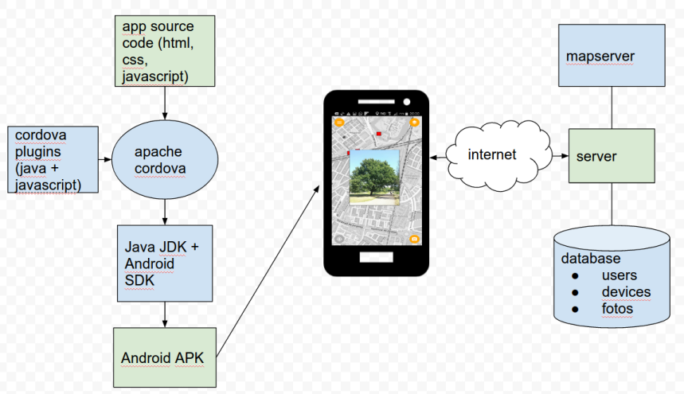

# growapp-mdl
GrowApp cordova/web-client creates time-lapse animations of vegetation

using [material design lite](https://getmdl.io/) (mdl)

## Overview



## Pre-requisites
* git
* node with npm
* android studio
* java jdk
* cordova (npm install cordova)

## Get source and dependencies
```
# get source from github
git clone https://github.com/anneb/growapp-mdl
cd growapp-mdl/www
# add dependencies
npm install
```

## Prepare Cordova
```
cd growapp-mdl
#install cordova dependencies as defined in config.xml
cordova prepare
```

## Setup device or emulator
**Device**

Connect your device to USB

**Android device emulator preparation**

* start->Android Studio-> new empty project
* menu tools-> Android -> AVD manager->create virtual device
*

# Deploy to device or emulator
```
cd growapp-mdl
cordova run
```

## bug? in cordova 6.4.0?
For some reason, cordova 6.4.0 copies the android app icons to the wrong directory.
After the first build, cordova created new directories:<br>
```res/mipmap-* ```

Manually copy or move:<br>
```res/mipmap-*```<br>
to:<br>
```platforms/android/res/```<br>
and rebuild the app.
